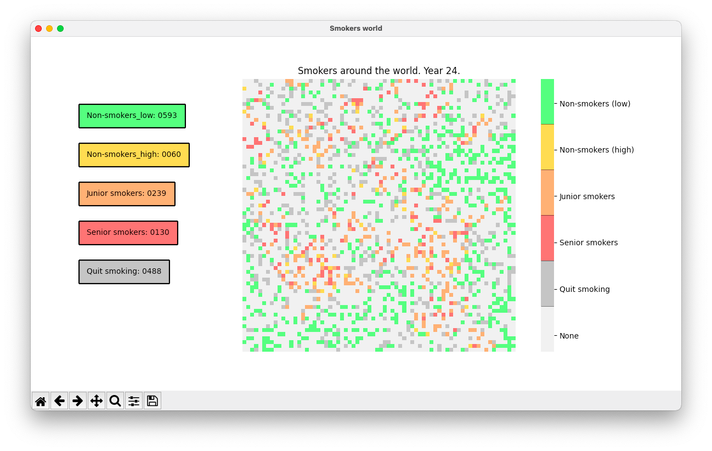
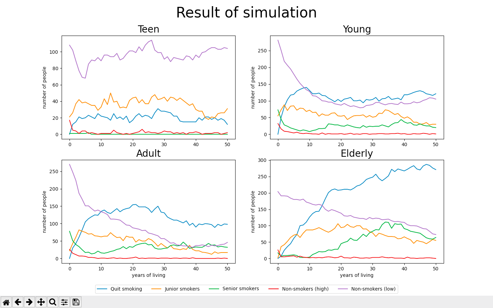

# Smoking Simulation

Smoking Simulation is an app to simulate the spreading of smokers and non-smokers, their interactions and population during certain amount of time.


## Description

The application allows users to observe simulation of spreading smokers and their behavior among given population parameters (3 different cases provided). Simulation rules and scenarios are based on real-life researches on smokers in the USA, EU, and Ukraine. After closing the simulation window, users can inspect 4 different plots showing the number of smokers in different age categories during the period of simulation.

The main engine of the project is finite state machine algorithms that run the logical part of the application. All the visuals are provided with Python libraries Matplotlib and Seaborn. 

## Visuals

The simulation process looks like this:



When the simulation is over, you can watch statistic plots representing data collected during the simulation



## Usage

To run the application, clone this repository locally and run the main module:
```bash
python3 main.py
```

## Support

In case you need some help, feel free to visit an issue tracker, a chat room, or connect us via [email address](hello@smoking-simulation.com).


## Contributing
Pull requests are welcome. For major changes, please open an issue first to discuss what you would like to change.

Please make sure to update tests as appropriate.

## Authors and acknowledgment

The project was developed by:
* [Karyna Volokhatiuk](https://github.com/karyna-volokhatiuk)
* [Oleksandra Stasiuk](https://github.com/oleksadobush)
* [Vira Saliieva](https://github.com/vsaliievaa)
* [Bohdan Ruban](https://github.com/iamthewalrus67)
* [Roman Kulyk](https://github.com/kkulykk)

## License
[MIT](LICENSE)
